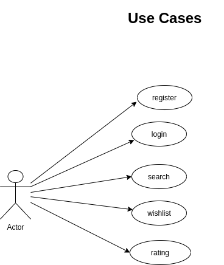
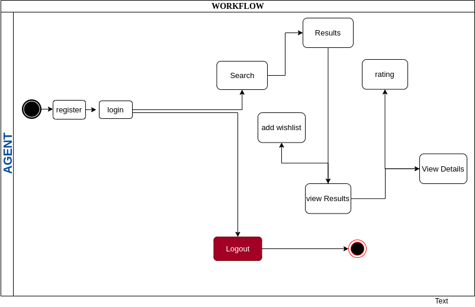
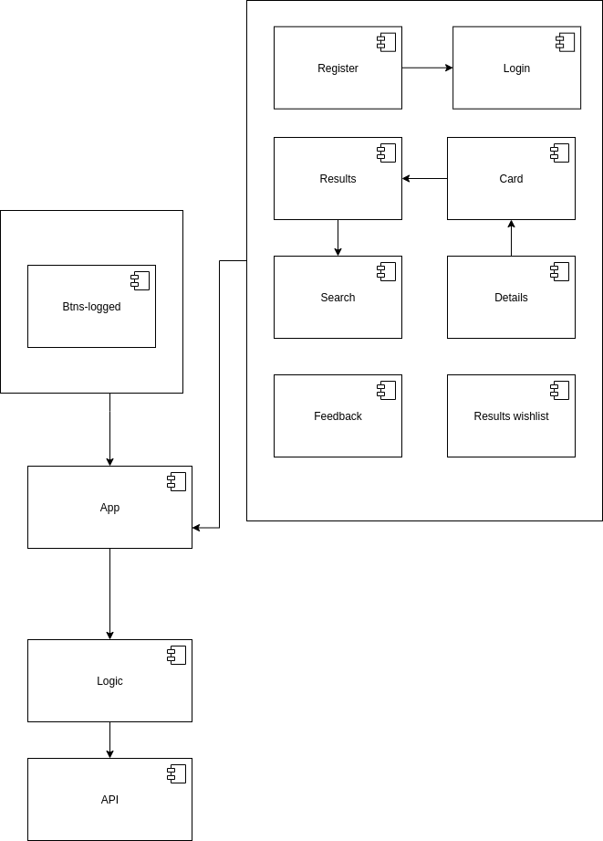
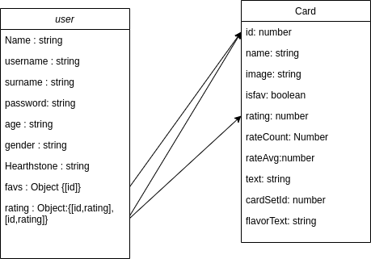

# HEARTHSTONE

## Introduction
This app is card browser of the populat Blizzard Game Hearthstone. The user can display a card, look at its additional details, add them to wishlist and can rate a card, while also checking how many people rated that card and the average rating

## Function Description
features : 
    · user can do :

        1. register in the application
        2. can loggin after make the register
        3. find cards
        4. find specific card due to exists filters
        5. can display the description of a card

## Flows (Activity    )   
                                                      
 
## Components diagram  
                                                      
 
## Data Model
 